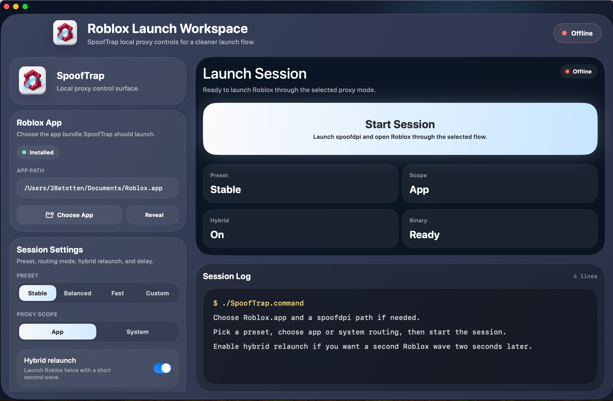

# SpoofTrap

Launch Roblox on networks that usually block it.

SpoofTrap is a macOS Roblox launcher built for restrictive networks, cleaner setup, and faster recovery when the normal launch flow fails.

  

  <a href="https://spooftrap.port0.org"><strong>Main site</strong></a>
  ·
  <a href="dist/SpoofTrap-macOS-2026.03.10.5.dmg"><strong>Download for macOS</strong></a>
  ·
  <a href="https://spooftrap.port0.org/windows.html"><strong>Windows roadmap</strong></a>

  

## Download

| Platform | Status | Link |
| --- | --- | --- |
| macOS | Available now | [DMG](dist/SpoofTrap-macOS-2026.03.10.5.dmg) |
| macOS alternate builds | Available now | [PKG](dist/SpoofTrap-macOS-2026.03.10.5.pkg) · [ZIP](dist/SpoofTrap-macOS-2026.03.10.5.zip) |
| Windows | In progress | [Roadmap](https://spooftrap.port0.org/windows.html) |

DMG is the easiest install. PKG and ZIP stay available if you need a different format.

## Quick Read

- macOS launcher for restrictive networks
- local bypass flow with a simpler launch workspace
- faster retries when the normal Roblox launch path fails
- Windows version is planned and tracked publicly, with the next estimate update planned for Sunday, March 29, 2026

## Updates

- Main site: [spooftrap.port0.org](https://spooftrap.port0.org)
- macOS page: [spooftrap.port0.org/macos.html](https://spooftrap.port0.org/macos.html)
- Windows roadmap: [spooftrap.port0.org/windows.html](https://spooftrap.port0.org/windows.html)
- Socials: [spooftrap.port0.org/socials.html](https://spooftrap.port0.org/socials.html)

## Notes

- This public repository is release-focused and does not include the private application source.
- macOS builds are available through the release files in `dist/` and on the website.
- Windows support is still in progress. The next public estimate update is planned for Sunday, March 29, 2026.

## Disclaimer

Use SpoofTrap only on systems and networks where you are authorized to do so. You are responsible for compliance with Roblox rules, local policy, and any network restrictions that apply to your environment.
